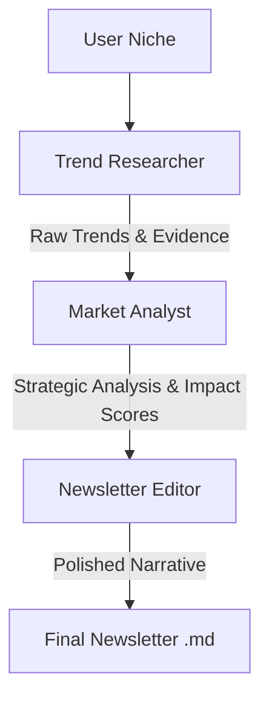

# Trend-Spotter: Technical Documentation

This document provides a comprehensive technical overview of the Trend-Spotter system, an AI-driven pipeline designed to automate the discovery of emerging trends and the creation of high-engagement newsletters.

## Table of Contents
1. [Executive Summary](#executive-summary)
2. [System Architecture](#system-architecture)
3. [Agent Framework](#agent-framework)
4. [Operational Workflow](#operational-workflow)
5. [Technical Specifications](#technical-specifications)
6. [Installation and Setup](#installation-and-setup)
7. [User Guide](#user-guide)
8. [Project Layout](#project-layout)

---

## Executive Summary
Trend-Spotter is engineered to transform unstructured digital signals into structured, actionable intelligence. By utilizing a multi-agent orchestration framework, the system replaces a linear prompt with a specialized pipeline of discovery, analysis, and synthesis.

The primary objective is to eliminate the "noise" of the internet and provide a curated newsletter that emphasizes strategic value over temporary hype.

---

## System Architecture
The system operates on a **Sequential Process** model. Each stage of the pipeline acts as a filter and refinement layer, ensuring that the final output is grounded in research and strategic analysis.

### Process Flow
`User Input (Niche)` $\rightarrow$ `Trend Researcher` $\rightarrow$ `Market Analyst` $\rightarrow$ `Newsletter Editor` $\rightarrow$ `Final Deliverable`

### Logic Diagram


### Operational Phases
1. **Discovery Phase**: Identification of emerging signals from platforms such as Reddit, X, and GitHub.
2. **Filtering Phase**: Critical evaluation of trends to distinguish genuine market shifts from transient hype.
3. **Synthesis Phase**: Transformation of technical data into a professional, reader-centric narrative.

---

## Agent Framework
The system employs three specialized AI agents, each defined by a unique persona, set of goals, and operational constraints.

### 1. Trend Researcher
*   **Primary Role**: Signal Intelligence & Discovery.
*   **Core Goal**: Identify the top 3 emerging trends within a specified niche.
*   **Capabilities**: Real-time web search via `SerperDevTool`, expert navigation of niche digital communities.

### 2. Market Analyst
*   **Primary Role**: Strategic Evaluation.
*   **Core Goal**: Assign impact scores (1-10) and develop a "why now" thesis for identified trends.
*   **Capabilities**: Synthesis of raw data into strategic theses, venture-capitalist-style market analysis.

### 3. Newsletter Editor
*   **Primary Role**: Content Synthesis & Storytelling.
*   **Core Goal**: Convert technical analysis into a high-engagement, punchy newsletter.
*   **Capabilities**: Professional journalism, storytelling, and narrative structure (The Hook, Body, CTA).

---

## Operational Workflow
The following table outlines the task distribution and expected deliverables for each agent in the pipeline.

| Task | Agent | Description | Expected Output |
| :--- | :--- | :--- | :--- |
| **Market Research** | Researcher | Systematic scan of digital signals for emerging trends. | A detailed report with supporting evidence. |
| **Strategic Analysis** | Analyst | Evaluation of trend significance and potential market impact. | Strategic analysis with impact scores. |
| **Editorial Synthesis** | Editor | Conversion of analysis into a professional newsletter. | A polished, ready-to-send newsletter. |

---

## Technical Specifications
The system is built on a modern Python stack, prioritizing execution speed and LLM flexibility.

### Core Dependencies
| Module / Service | Purpose | Implementation Detail |
| :--- | :--- | :--- |
| **`crewai`** | Agent Orchestration | Framework for multi-agent collaboration and sequential processing. |
| **`crewai_tools`** | Tool Integration | Provides the `SerperDevTool` for real-time web search capabilities. |
| **`uv`** | Package Management | High-performance dependency resolution and environment management. |
| **`OpenRouter`** | LLM Gateway | Unified API access to multiple state-of-the-art LLMs. |
| **`Serper.dev`** | Search API | Enterprise-grade Google Search API for signal discovery. |
| **`python-dotenv`** | Configuration | Secure management of sensitive API keys via `.env` files. |

---

## Installation and Setup

### Prerequisites
- **Python**: Version 3.10 - 3.12
- **Required API Keys**:
    - `SERPER_API_KEY`: Obtained from Serper.dev.
    - `OPENROUTER_API_KEY`: Obtained from OpenRouter.ai.

### Deployment Steps
1. **Clone the Repository**:
   ```bash
   git clone <repo-url>
   cd project_root
   ```
2. **Initialize Environment**:
   ```bash
   uv sync
   ```
3. **Configuration**:
   Create a `.env` file in the root directory with the following keys:
   ```env
   SERPER_API_KEY=your_serper_key
   OPENROUTER_API_KEY=your_openrouter_key
   MODEL_NAME=openai/minimax/minimax-m3:free
   ```

---

## User Guide

### Execution
The application can be executed via the command line using the following methods:

**Method A: Direct Niche Input**
```bash
uv run trend-spotter "Generative AI in Architecture"
```

**Method B: Interactive Mode**
```bash
uv run trend-spotter
```

### Output
The system generates a Markdown file (`.md`) in the project root, named according to the niche provided (e.g., `newsletter_generative_ai.md`).

---

## Project Layout
The codebase is organized to separate agent definitions, task logic, and orchestration.

```text
project_root/
├── trend_spotter/
│   ├── __init__.py       # Package initialization
│   ├── agents.py         # Agent personas and LLM configuration
│   ├── tasks.py          # Task requirements and definitions
│   ├── crew.py           # Crew orchestration and execution logic
│   └── main.py           # Application entry point and TUI
├── pyproject.toml        # Project metadata and dependency list
├── uv.lock               # Locked dependency versions
└── README.md             # High-level project overview
```
